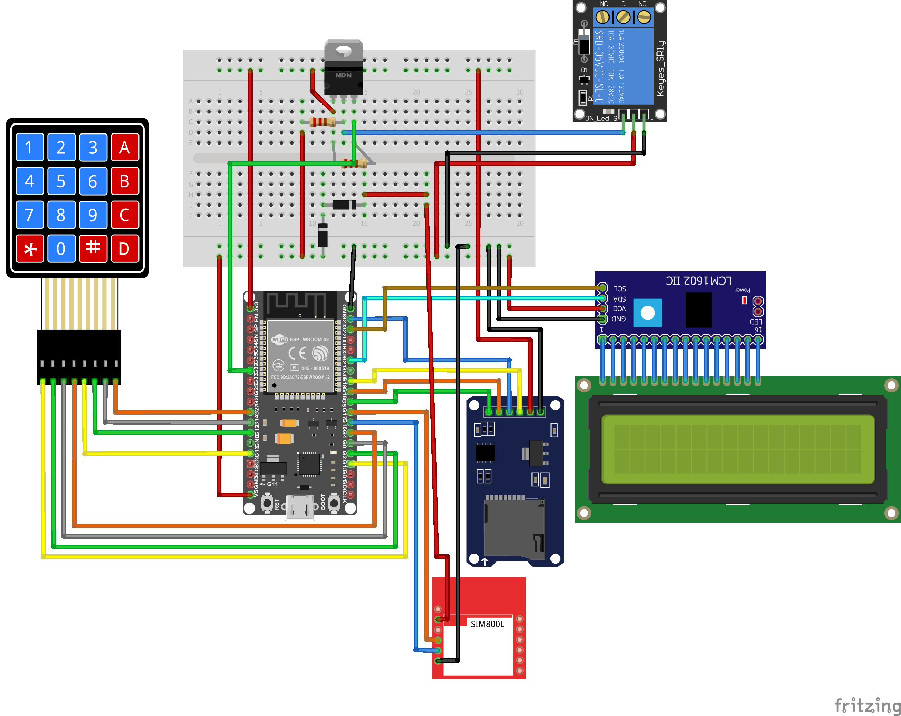

# SmartLock

Cerradura inteligente realizada con Arduino. Permite su uso por medio de un bot de Telegram y un teclado numérico.

## Tipos de operación

La operación de la cerradura permite 9 tipo de operaciones al usar el bot de Telegram o el teclado numérico.

| **Tipo** |                                             **Función**                                            | **Parámetros** |
|:--------:|:--------------------------------------------------------------------------------------------------:|:--------------:|
|     0    |                                          Abre la cerradura                                         |        -       |
|     1    | Agrega un usuario a la base de datos, con permisos de abrir la cerradura y cambiar su propia clave | Usuario, Clave |
|     2    |                               Elimina un usuario de la base de datos                               |     Usuario    |
|     3    |                                Cambia la clave de cualquier usuario                                | Usuario, Clave |
|     4    |                                       Cambia la clave propia                                       |      Clave     |
|     5    |               Autoriza a un usuario para realizar un tipo de operacion en específico               |  Usuario, Tipo |
|     6    |                  Le quita el permiso para una operación en específico a un usuario                 |  Usuario, Tipo |
|     7    |                                Agrega un teléfono a la base de datos                               |    Teléfono    |
|     8    |                               Elimina un teléfono de la base de datos                              |    Teléfono    |

## Circuito

## TODO

- Agregar imagen de circuito con los pines utilizados.  
- Eliminar id telegram y configuración wifi hard-coded.
- Agregar librerías utilizadas.  
- Mejorar README.  
- Arreglar posibles bugs.  